# **一、簡介- 涂鸦 T5 AI 口袋机**

**Tuya-T5-Pocket** 是一个基于TuyaOpen开源框架打造的便携掌机。可以深度的接入多模态AI-Agent LLM大模型和音视频多模态大模型。此开源项目搭配涂鸦T5 WIFI/蓝牙芯片模组，从硬件设计到软件代码全开源。设计了丰富的内置传感器和外置拓展能力。

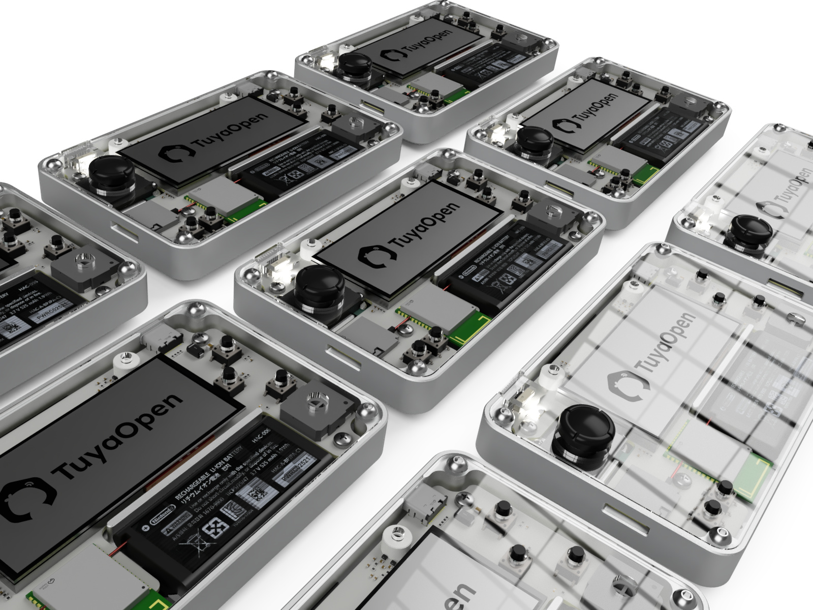

### 覆盖场景
- 多模态大模型 AI-Agent 端云开发
- AI 虚拟宠物 （拓麻歌子）
- AI 管家 任何问题问答
- 智能居家控制/被控: 你可以定制任何连网的IoT设备，轻松接入Tuya App
- 游戏掌机
- 丰富外设传感器拓展可行性 （10P I/O，和串口 Pogo-Pin）
> *** 能力丰富和高度灵活，面向开发者，也激发开发者开发好玩有意思的 AI-Agent + 硬件的整合和验证。

### 核心硬件能力
- 涂鸦T5模组 （WIFI 6 + BLE 5.4）
- 2.9 英寸单色低功耗 LCD 屏幕
- 4G蜂窝，提升便携性
- 摄像头
- 麦克风/喇叭
- 6轴传感器
- 任天堂同款手柄和电池
- MicroSD卡 外部存储
- 丰富手柄（x-y）和按键输入
其他：
- 可扩展Pogo Pin弹簧针（电源+UART）
- 可扩展 10 针排针（I2C/SPI/UART/GPIO）
- USB Type-C 2.0 接口（充电/烧录/调试）

---

# **二、硬件** 
## **1.硬件总体设计**
如图所示，Tuya-T5-Pocket 的整体硬件架构涵盖了主控模块（涂鸦T5模组）、显示屏、摄像头、音频模块（麦克风/喇叭）、多种传感器、用户输入设备（摇杆、按键）、存储（MicroSD卡）、扩展接口（Pogo Pin弹簧针和10针排针）、电池管理及通信（4G蜂窝、WIFI/BLE、USB Type-C）。整个系统高度集成，支持多模态交互，并为开发者提供丰富的拓展和定制空间。

## 架构图
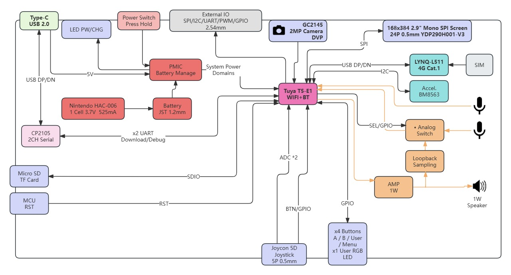

基于涂鸦T5芯片来选型有个非常好的好处，低功耗，WIFI，蓝牙，摄像头，麦克风，喇叭，点屏都已经最大程度的集成到了T5芯片/模组里面。完完全全的满足集成性，还有所有多模态大模型 AI Agent 交互所需要的能力。实在是专门为大模型量身打造的芯片。丰富的外设拓展也最大程度的为开发者提供，传感器数据与大模型深度整合的可行性，交互方法超越音视频模态本身。文本数据也是一个非常好的交互模态。

## **3.PCB/FPC 工艺**
### 口袋机主板工艺 
  - 4 层板
  - 板厚：1.2mm 
  - 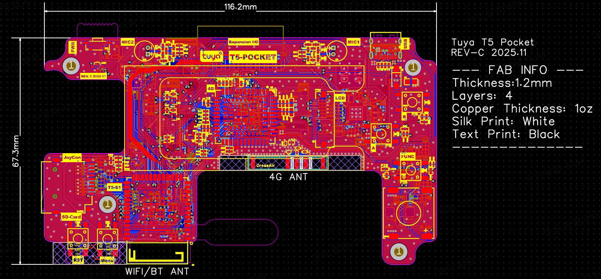
  - 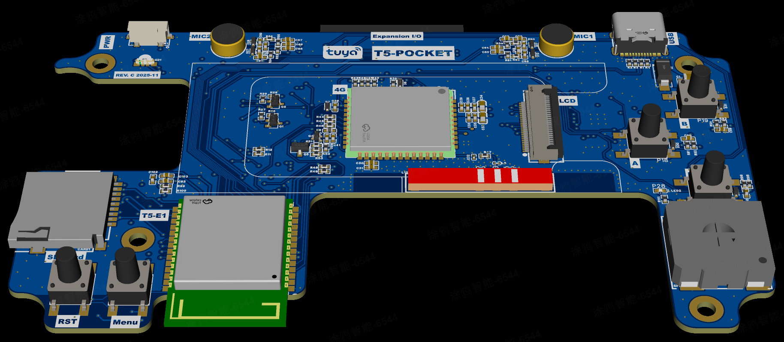
  - 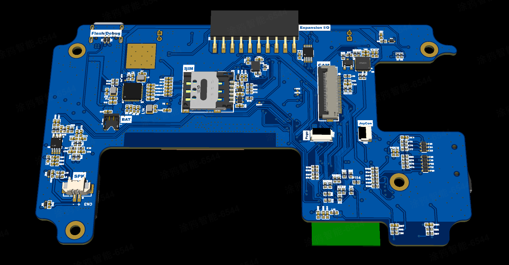

### Pogo Pin FPC 排线工艺
  - 2 层板
  - 板厚：0.15mm 
  - 补强：PI 0.15mm 
  - *** 注意： 补强用PI材料，钢片补强会影响 Pogo 磁铁的磁力
  - 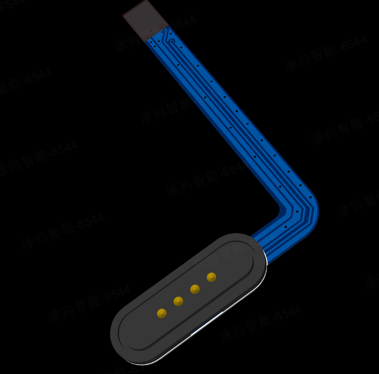

# **4. 采买清单**
### 3D 打印壳件外观件 （嘉立创打样）
- 1个，主机外壳 (3D打印，或是CNC)  
  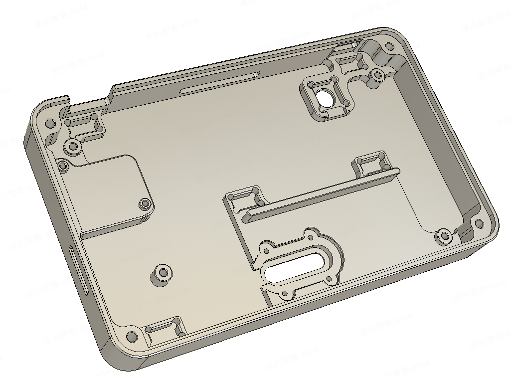
- 1个，屏幕垫高  
  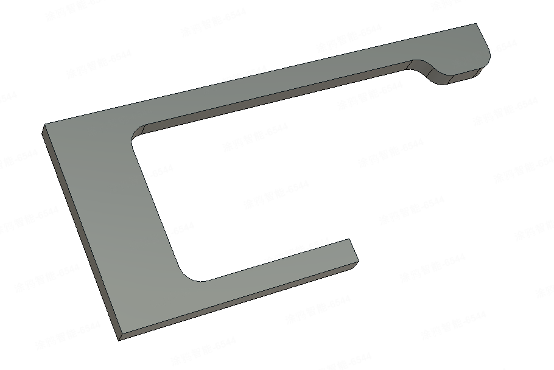
- 1个，Pogo Pin压板  
  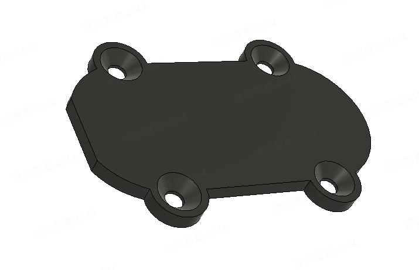

### 亚克力 2/4mm
- 1个，开机键 4mm厚 透明亚克力  
  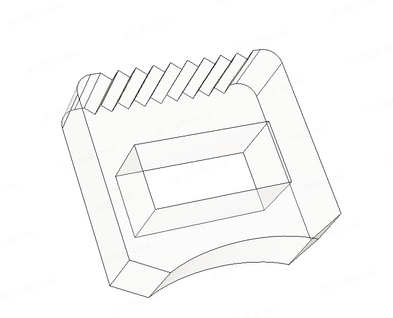
- 1个，面板 2mm厚 透明亚克力  
  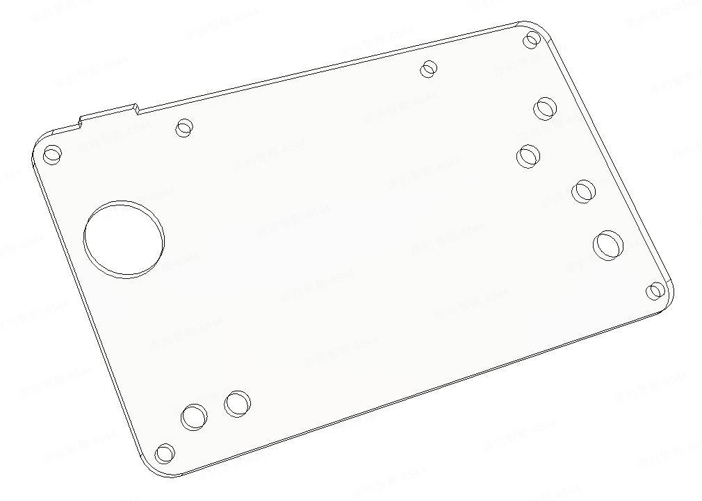

### 主板电子
- 1个，口袋机主板 PCB + PCBA + BOM （嘉立创打板）
  - 以下为关键器件购买渠道
    - 主控：涂鸦 T5-E1 模组 [Datasheet](https://developer.tuya.com/en/docs/iot/T5-E1-IPEX-Module-Datasheet?id=Kdskxvxe835tq) | [购买](https://item.taobao.com/item.htm?id=955761378079&skuId=6046643070209&spm=a1z10.5-c-s.w4002-24402091062.26.2e125cb0A7btbo)
    - 屏幕: 鱼鹰光电2.9寸全反屏无背光超低功耗 [购买](https://item.taobao.com/item.htm?_u=4209mhub8e731a&id=694950723796&spm=a1z09.2.0.0.2c7b2e8dU03Y3i)
    - 4G蜂窝: 移柯 L511C 4G cat-1 [购买](https://detail.tmall.com/item.htm?abbucket=12&id=747469195187&mi_id=0000RotWdJ65EITqgUOGXXFVZUBrcCH3nrNawVYWpBN4rYo&ns=1&priceTId=2147862d17648357799475890e1a14&skuId=5151626680341&spm=a21n57.1.hoverItem.1&utparam=%7B%22aplus_abtest%22%3A%22524e1049bd5f00653f6a5eefcd5d8792%22%7D&xxc=taobaoSearch)
>蜂窝有两颗可以选择 `中移 ML307R` 或是 `移柯 L511C`。为 Pin对Pin 可以直接替换。TuyaOpen 支持上实测 `移柯 L511C` 表现更为优异。底层协议有深度优化，语音对话延时更加低。

- 1个，Pogo FPC（嘉立创打板）
    - 1个，Pogo 公母座 [购买](https://item.taobao.com/item.htm?_u=4209mhub8ee433&id=684828297189&spm=a1z09.2.0.0.38732e8dxWALxH)

### 装配配件
- 1个，摄像头：GC2145，分辨率：2 MP（1616 x 1232 像素）[Datasheet](https://e2e.ti.com/cfs-file/__key/communityserver-discussions-components-files/968/GC2145-CSP-DataSheet-release-V1.0_5F00_20131201.pdf) | [购买](https://item.taobao.com/item.htm?id=888150036714&skuId=6020719858877&spm=a1z10.5-c-s.w4002-24402091062.20.21aa5cb0POTsvY)
- 1个，任天堂手柄: switch手柄修配件   
    
- 1个，任天堂电池: switch左右手柄 HAC-006 电池 525mAh [购买](https://item.taobao.com/item.htm?abbucket=12&id=703587008937&mi_id=0000c0L1ujrnm8arvH1f83RfKdQUSiUw2SApmPzdyHi06_Q&ns=1&priceTId=214787d017648359890651639e1122&skuId=5129905499147&spm=a21n57.1.hoverItem.2&utparam=%7B%22aplus_abtest%22%3A%226e88bd111668d99016d34df6b4d04988%22%7D&xxc=taobaoSearch)  
    

### 五金辅料
- 5颗，磁铁 8x4x3mm 长方形 [购买](https://item.taobao.com/item.htm?abbucket=12&id=668528102597&mi_id=0000T8j2g5rjX9due5RgZnluin2OwF66xMZFLzdxholsDX4&ns=1&priceTId=2147bf7817648380141535145e19ab&skuId=5107004608405&spm=a21n57.1.hoverItem.2&utparam=%7B%22aplus_abtest%22%3A%22f5237d925dc706012d7f600620a565c3%22%7D&xxc=taobaoSearch)
- 1个，导电泡棉-宽8mm长8mm厚3mm：固定摄像头用 [购买](https://item.taobao.com/item.htm?abbucket=12&detail_redpacket_pop=true&id=736892737069&ltk2=1750823648666gxzk0xb1jti96heo6jldf6&ns=1&priceTId=213e036617508236170281687e1b2f&query=%E5%AF%BC%E7%94%B5%E6%B3%A1%E6%A3%89&spm=a21n57.1.hoverItem.7&utparam=%7B%22aplus_abtest%22%3A%22586914bba13e2d8788393cdd636afb7f%22%7D&xxc=taobaoSearch)

### 螺丝
- 4颗，M3x0.5x8mm 圆头-内六角-细牙螺丝：锁附外壳面板螺丝 [购买](https://detail.tmall.com/item.htm?_u=4209mhub8ed172&id=636577427255&spm=a1z09.2.0.0.38732e8dngu9y2)
- 4颗，M2.5x0.5x3mm 圆头-内十字-细牙螺丝 ：锁附主板 [购买](https://detail.tmall.com/item.htm?_u=4209mhub8e9978&id=637524754721&spm=a1z09.2.0.0.38732e8dngu9y2)
- 2颗，M1.6x4mm 圆头-内十字-细牙螺丝: 锁附摇杆 [购买](https://detail.tmall.com/item.htm?_u=4209mhub8e9978&id=637524754721&spm=a1z09.2.0.0.38732e8dngu9y2)
- 4颗，M1.6*3 ：沉头-十字点胶螺丝：锁附Pogo Pin FPC [购买](https://item.taobao.com/item.htm?_u=4209mhub8e89db&id=624775124317&spm=a1z09.2.0.0.38732e8dngu9y2)

### 耗材
- 1个, PP结构胶  固定磁铁-点胶 [购买](https://item.taobao.com/item.htm?abbucket=12&detail_redpacket_pop=true&id=654073481432&ltk2=17508241823513i6pgapgewtmpgs5q9ant&ns=1&priceTId=215041db17508241761674633e19d5&query=PP%E7%BB%93%E6%9E%84%E8%83%B6&skuId=4896441859632&spm=a21n57.1.hoverItem.4&utparam=%7B%22aplus_abtest%22%3A%22b2294f3336e9ed8e65606b92679dac77%22%7D&xxc=taobaoSearch)
- 4个，硅胶止滑垫 8mm x 1mm [购买](https://item.taobao.com/item.htm?_u=p209mhub8ef8e3&id=771706659250&spm=a1z09.2.0.0.59c42e8dblv6aX)
- 双面胶 3mm宽：用来固定屏幕和电池
---

# **三、结构- 复刻教程**
**1.外观设计**

**2.内部结构设计**

**3.装机教程**

**3.1 开发板正反，部件总览**  

  

**3.2 PP结构胶，磁铁点胶**  
少量即可，点入磁铁四周的圆槽里面  
  

**3.3 POGO FPC 软排线安装**  
4颗，M1.6*3 ：沉头-十字点胶螺丝：锁附Pogo Pin FPC
  

**3.4 贴硅胶停滑垫**  
4个，硅胶止滑垫 8mm x 1mm  

**3.5 放在麦克风气密硅胶垫**  

**3.6 屏幕垫高**  
可3D打印或是透明亚克力3mm。正反都贴上3mm宽的双面胶  

  
插入屏幕排线贴合  
> **注意!!!!**: 屏幕垫高件有局部“悬空”，贴合压紧时，悬空处“不要”过度施力，避免屏幕破裂！！   

**3.7 摄像头贴导电泡棉**  
导电泡棉可帮助散热，静电和GND  

**3.8 主板装配**
- 连接电池手柄和摄像头排线  
- 摄像头排线可以预先折45度转角和多余排线。便于等下装配，泡棉对位到PCB的GND上面

  
- 插入Pogo Pin FPC 排线此方法和方向比较便于安装排线   

- 从顶先放入，顶部的拓展IO排座滑入到位  

- 这一步稍微比较别扭，用镊子稍微调整摄像头位置确保入槽。

- 锁附螺丝
  - 主板，4颗，M2.5x3mm 
  - 手柄，2颗，M1.6x4mm  
  

**3.9 开机键安装**  

**3.10 面板安装**  
- 可选，喇叭和麦克风防灰网
- 最后4颗M3固定  

**3.11 外接拓展I/O 贴纸标签**  

# **四、软件**
## **1.软件整体框架**

## 用户输入定义
实际硬件输入HID

| 输入         | 功能描述                                 |
|--------------|------------------------------------------|
| 摇杆         | 菜单/应用导航                            |
| 摇杆按下     | 功能未定义                               |
| A 键         | 确认/选择/游戏 A                         |
| B 键         | 取消/返回/游戏 B                         |
| 功能键       | AI-LLM、音频及其他应用功能快捷入口        |
| 菜单键       | 主菜单访问                               |
| 用户 LED     | 指示 AI 功能活动，可自定义                |
| 复位键       | T5 MCU 硬件复位                          |

## 示例：涂鸦 AI 宠物

体验新一代虚拟宠物！涂鸦 AI 宠物主机演示展示了先进的音频，视觉大，文本游戏模型（LLM）功能，让你的数字伙伴通过自然语音对话和情感感知与您互动。享受“类拓麻歌子-电子宠物”式的冒险，你的宠物会根据你的情绪和语音做出回应，带来真正沉浸和有趣的虚拟陪伴体验。

- 摇杆手柄交互
- 语音模态交互
- 加速度传感交互
- 视觉模态感知
- 文本模态输入
