# **一、简介 - 涂鸦 T5 AI 口袋机**

**Tuya-T5-Pocket** 是一款基于 TuyaOpen 开源框架打造的便携掌机。可深度接入多模态 AI-Agent LLM 大模型和音视频多模态大模型。本项目搭配涂鸦 T5 WiFi/蓝牙芯片模组，从硬件设计到软件代码完全开源，内置丰富的传感器并具备强大的外置扩展能力。


### 覆盖场景
- 多模态大模型 AI-Agent 端云开发
- AI 虚拟宠物 （拓麻歌子）
- AI 管家 任何问题问答
- 智能居家控制/被控: 你可以定制任何连网的IoT设备，轻松接入Tuya App
- 游戏掌机
- 丰富的外设传感器扩展能力（10P I/O 和串口 Pogo-Pin）
> *** 能力丰富且高度灵活，面向开发者，激发开发者开发有趣且富有创意的 AI-Agent + 硬件整合方案。

### 核心硬件能力
- 涂鸦T5模组 （WIFI 6 + BLE 5.4）
- 2.9 英寸单色低功耗 LCD 屏幕
- 4G蜂窝，提升便携性
- 摄像头
- 麦克风/喇叭
- 6轴传感器
- 任天堂同款手柄和电池
- MicroSD卡 外部存储
- 丰富的摇杆（X-Y 轴）和按键输入

**扩展接口：**
- 可扩展Pogo Pin弹簧针（电源+UART）
- 可扩展 10 针排针（I2C/SPI/UART/GPIO）
- USB Type-C 2.0 接口（充电/烧录/调试）

---

# **二、硬件** 
## **1. 硬件总体设计**
如图所示，Tuya-T5-Pocket 的整体硬件架构涵盖了主控模块（涂鸦T5模组）、显示屏、摄像头、音频模块（麦克风/喇叭）、多种传感器、用户输入设备（摇杆、按键）、存储（MicroSD卡）、扩展接口（Pogo Pin弹簧针和10针排针）、电池管理及通信（4G蜂窝、WIFI/BLE、USB Type-C）。整个系统高度集成，支持多模态交互，并为开发者提供丰富的拓展和定制空间。

## **2. 架构图**


选择涂鸦 T5 芯片具有显著优势：低功耗、WiFi、蓝牙、摄像头、麦克风、喇叭、显示屏等都已高度集成到 T5 芯片/模组中，完全满足集成性要求，并具备多模态大模型 AI Agent 交互所需的所有能力，可谓专为大模型应用量身打造。丰富的外设扩展能力为开发者提供了传感器数据与大模型深度整合的可行性，交互方式不仅限于音视频模态，文本数据也是极佳的交互模态。

## **3. PCB/FPC 工艺**
### 口袋机主板工艺
- 4 层板
- 板厚：1.2mm 
  - 
  - 
  - 

### Pogo Pin FPC 排线工艺
- 2 层板
- 板厚：0.15mm
- 补强：PI 0.15mm
- **⚠️ 注意**：补强需使用 PI 材料，钢片补强会影响 Pogo 磁铁的磁力
  - 

## **4. 采购清单**
### 3D 打印外壳件（嘉立创打样）
- 1 个，主机外壳（3D 打印或 CNC 加工）  
  
- 1 个，屏幕垫高件  
  
- 1 个，Pogo Pin 压板  
  

### 亚克力件（2mm/4mm）
- 1 个，开机键（4mm 厚透明亚克力）  
  
- 1 个，面板（2mm 厚透明亚克力）  
  

### 主板电子器件
- 1 个，口袋机主板 PCB + PCBA + BOM（嘉立创打板）
  - 以下为关键器件购买渠道：
    - **主控**：涂鸦 T5-E1 模组 [Datasheet](https://developer.tuya.com/en/docs/iot/T5-E1-IPEX-Module-Datasheet?id=Kdskxvxe835tq) | [购买](https://item.taobao.com/item.htm?id=955761378079&skuId=6046643070209&spm=a1z10.5-c-s.w4002-24402091062.26.2e125cb0A7btbo)
    - **屏幕**：鱼鹰光电 2.9 寸全反屏无背光超低功耗 [购买](https://item.taobao.com/item.htm?_u=4209mhub8e731a&id=694950723796&spm=a1z09.2.0.0.2c7b2e8dU03Y3i)
    - **4G 蜂窝**：移柯 L511C 4G Cat-1 [购买](https://detail.tmall.com/item.htm?abbucket=12&id=747469195187&mi_id=0000RotWdJ65EITqgUOGXXFVZUBrcCH3nrNawVYWpBN4rYo&ns=1&priceTId=2147862d17648357799475890e1a14&skuId=5151626680341&spm=a21n57.1.hoverItem.1&utparam=%7B%22aplus_abtest%22%3A%22524e1049bd5f00653f6a5eefcd5d8792%22%7D&xxc=taobaoSearch)
> 4G 蜂窝模块有两种选择：`中移 ML307R` 或 `移柯 L511C`。两者 Pin 对 Pin 兼容，可直接替换。TuyaOpen 框架实测显示 `移柯 L511C` 表现更为优异，底层协议经过深度优化，语音对话延时更低。

- 1 个，Pogo Pin FPC（嘉立创打板）
    - 1 个，Pogo 公母座（目前 FPC 上件的是母座 YZ103915020T-04025-02/4pin）[购买](https://item.taobao.com/item.htm?_u=4209mhub8ee433&id=684828297189&spm=a1z09.2.0.0.38732e8dxWALxH)

### 装配配件
- 1 个，摄像头：GC2145，分辨率：2 MP（1616 × 1232 像素）[Datasheet](https://e2e.ti.com/cfs-file/__key/communityserver-discussions-components-files/968/GC2145-CSP-DataSheet-release-V1.0_5F00_20131201.pdf) | [购买](https://item.taobao.com/item.htm?id=888150036714&skuId=6020719858877&spm=a1z10.5-c-s.w4002-24402091062.20.21aa5cb0POTsvY)
- 1 个，任天堂手柄：Switch 手柄修配件   
    
- 1 个，任天堂电池：Switch 左右手柄 HAC-006 电池 525mAh [购买](https://item.taobao.com/item.htm?abbucket=12&id=703587008937&mi_id=0000c0L1ujrnm8arvH1f83RfKdQUSiUw2SApmPzdyHi06_Q&ns=1&priceTId=214787d017648359890651639e1122&skuId=5129905499147&spm=a21n57.1.hoverItem.2&utparam=%7B%22aplus_abtest%22%3A%226e88bd111668d99016d34df6b4d04988%22%7D&xxc=taobaoSearch)  
    


### 辅料
- 5 颗，磁铁（8×4×3mm 长方形）[购买](https://item.taobao.com/item.htm?abbucket=12&id=668528102597&mi_id=0000T8j2g5rjX9due5RgZnluin2OwF66xMZFLzdxholsDX4&ns=1&priceTId=2147bf7817648380141535145e19ab&skuId=5107004608405&spm=a21n57.1.hoverItem.2&utparam=%7B%22aplus_abtest%22%3A%22f5237d925dc706012d7f600620a565c3%22%7D&xxc=taobaoSearch)
- 1 个，导电泡棉（宽 8mm × 长 8mm × 厚 3mm），用于固定摄像头 [购买](https://item.taobao.com/item.htm?abbucket=12&detail_redpacket_pop=true&id=736892737069&ltk2=1750823648666gxzk0xb1jti96heo6jldf6&ns=1&priceTId=213e036617508236170281687e1b2f&query=%E5%AF%BC%E7%94%B5%E6%B3%A1%E6%A3%89&spm=a21n57.1.hoverItem.7&utparam=%7B%22aplus_abtest%22%3A%22586914bba13e2d8788393cdd636afb7f%22%7D&xxc=taobaoSearch)
- 2 个，麦克风气密硅胶垫，6035咪套（7.0*4.2mm)[购买](https://item.taobao.com/item.htm?_u=5209mhub8ef8d3&id=606897448317&skuId=4432711567694&spm=a1z09.2.0.0.7a942e8dAFrxV5)

### 螺丝
- 4 颗，M3×0.5×8mm 圆头内六角细牙螺丝（锁附外壳面板）[购买](https://detail.tmall.com/item.htm?_u=4209mhub8ed172&id=636577427255&spm=a1z09.2.0.0.38732e8dngu9y2)
- 4 颗，M2.5×0.5×3mm 圆头内十字细牙螺丝（锁附主板）[购买](https://detail.tmall.com/item.htm?_u=4209mhub8e9978&id=637524754721&spm=a1z09.2.0.0.38732e8dngu9y2)
- 2 颗，M1.6×4mm 圆头内十字细牙螺丝（锁附摇杆）[购买](https://detail.tmall.com/item.htm?_u=4209mhub8e9978&id=637524754721&spm=a1z09.2.0.0.38732e8dngu9y2)
- 4 颗，M1.6×3mm 沉头十字点胶螺丝（锁附 Pogo Pin FPC）[购买](https://item.taobao.com/item.htm?_u=4209mhub8e89db&id=624775124317&spm=a1z09.2.0.0.38732e8dngu9y2)

### 耗材
- 1 个，PP 结构胶（固定磁铁用）[购买](https://item.taobao.com/item.htm?abbucket=12&detail_redpacket_pop=true&id=654073481432&ltk2=17508241823513i6pgapgewtmpgs5q9ant&ns=1&priceTId=215041db17508241761674633e19d5&query=PP%E7%BB%93%E6%9E%84%E8%83%B6&skuId=4896441859632&spm=a21n57.1.hoverItem.4&utparam=%7B%22aplus_abtest%22%3A%22b2294f3336e9ed8e65606b92679dac77%22%7D&xxc=taobaoSearch)
- 4 个，硅胶止滑垫（8mm × 1mm）[购买](https://item.taobao.com/item.htm?_u=p209mhub8ef8e3&id=771706659250&spm=a1z09.2.0.0.59c42e8dblv6aX)
- 双面胶（3mm 宽），用于固定屏幕和电池
---

# **三、结构 - 复刻教程**
## **3. 装机教程**

**Step 1：开发板正反面及部件总览**  


  

**Step 2：PP 结构胶点胶固定磁铁**  
使用少量 PP 结构胶，点入磁铁四周的圆槽内  
  


**Step 3：Pogo Pin FPC 软排线安装**  
使用 4 颗 M1.6×3 沉头十字点胶螺丝锁附 Pogo Pin FPC
  


**Step 4：贴硅胶止滑垫**  
使用 4 个硅胶止滑垫（8mm × 1mm）  


**Step 5：放置麦克风气密硅胶垫**  


**Step 6：屏幕垫高**  
可3D打印或是透明亚克力3mm。正反都贴上3mm宽的双面胶  

  
插入屏幕排线贴合  
> **注意!!!!**: 屏幕垫高件有局部“悬空”，贴合压紧时，悬空处“不要”过度施力，避免屏幕破裂！！   


**Step 7：摄像头贴导电泡棉**  
导电泡棉可帮助散热、防静电并连接 GND  


**Step 8：主板装配**
- 连接电池手柄和摄像头排线  
- 摄像头排线可预先折成 45 度转角并整理多余排线，便于后续装配，确保泡棉对位到 PCB 的 GND 上  

  
- 插入 Pogo Pin FPC 排线，此方法和方向便于安装排线   


- 从顶部先放入，顶部的扩展 IO 排座滑入到位  


- 此步骤操作稍显不便，可用镊子微调摄像头位置，确保入槽  


- 锁附螺丝
  - 主板：4 颗 M2.5×3mm 
  - 手柄：2 颗 M1.6×4mm  
  


**Step 9：开机键安装**  


**Step 10：面板安装**  
- 可选：安装喇叭和麦克风防灰网
- 最后使用 4 颗 M3 螺丝固定  


**Step 11：外接扩展 I/O 贴纸标签**  


# **四、软件**
软件部分基于 [TuyaOpen 开源框架](http://tuyaopen.ai/)。TuyaOpen 是一个面向 AI Agent + IoT 的完整类 RTOS 操作系统。该开源框架可助力开发者高效开发传统 IoT 连接设备，实现快速配网流程和 App 交互能力。此外，AI Agent 能力可深度整合到端侧硬件，实现端云结合，为硬件提供更高的泛化能力，使 AI Agent 与场景结合得更好。

## **1. 口袋机 Demo 提供以下功能：**  

**涂鸦云开发：**
- DP（Data Point）数据点上报，实现 App 数据交互
- 端云连接，API 极简化
- P2P 视频串流到 App

**AI Agent ｜ 大模型能力：**
- 音频/视频/文本 AI 多模态交互
- 云端AI Workflow 定制能力
- AI Agent 设备自控/他控，Function-Call 能力
- MCP（Model Context Protocol）自定义 MCP Server 能力 [Tuya MCP SDK](https://github.com/tuya/tuya-mcp-sdk)

**算法/引擎：**
- 端侧 3A 算法（VAD/KWS/AEC/ANR/AGC 等），为端侧拾音提供良好的声学条件
- LVGL 图形渲染引擎

**硬件 API：**
- 软件/硬件开源，支持二次开发
- 掌机各外设驱动和示例代码
- 游戏机摇杆交互逻辑，场景扩展丰富
- 音/视频二次开发
- 4G 蜂窝联网示例
- 丰富的外设扩展能力，等待您来探索...


## **2. 软件整体框架**

Tuya-T5-Pocket 软件架构基于 TuyaOpen 框架构建，采用分层设计，主要包含硬件 BSP 层、云 IoT 事件层、UI 层和 AI 层四个核心层次。

- **硬件 BSP 层**：位于最底层，负责硬件抽象和驱动管理。通过 Tuya Abstract Layer (TAL) 提供统一的硬件接口，包括显示屏、摄像头、麦克风、喇叭、传感器、摇杆按键等外设的驱动。BSP 层屏蔽了底层硬件差异，为上层提供标准化的硬件访问接口。  
板级初始化通常在应用启动时由 `board_register_hardware()` 函数完成，负责各硬件外设和驱动的初始化，为上层模块提供基础硬件支撑。

- **云 IoT 事件层**：负责与涂鸦云平台的通信和事件处理。通过 MQTT 协议与云端建立连接，处理设备绑定、数据点（DP）上报和接收、OTA 升级、时间同步等云服务事件。当收到云端指令时，通过事件回调机制通知上层应用，同时将设备状态和用户操作同步到云端和 App 端。

- **UI 层**：基于 LVGL 图形渲染引擎实现用户界面。负责屏幕显示、菜单导航、动画效果和用户交互反馈。UI 层通过消息机制接收来自其他层的事件通知，实时更新界面状态，如网络连接状态、电池电量、AI 功能状态等。支持多语言显示和主题切换。

- **AI 层**：提供多模态 AI 能力，包括音频处理、语音识别、LLM 对话和 AI Agent 功能。集成了端侧 3A 算法（VAD/KWS/AEC/ANR/AGC）用于音频预处理，支持音频、视频、文本多模态交互。AI 层可以接收用户语音输入，通过云端大模型进行理解和生成，并将结果反馈给用户。同时支持 Function-Call 能力，使 AI Agent 可以控制设备功能。


**核心组件**：系统主要包含以下核心组件：
- `tuya_iot`：云服务核心，管理设备连接、DP 通信和云事件处理
- `ai_audio`：AI 音频处理模块，负责音频采集、播放和云端 AI 交互
- `app_display`：显示管理模块，负责 LVGL 初始化和界面消息分发
- `game_pet`：AI 宠物应用，展示多模态 AI 交互和状态管理
- `app_pocket`：主应用协调器，初始化各模块并处理应用级事件

整个架构设计遵循模块化和解耦原则，各层职责清晰，便于开发者进行二次开发和功能扩展。

## **3. 数据与事件流**

系统通过事件驱动机制实现用户、硬件、UI 和云端 AI 之间的数据流转和交互。以下是主要的数据流和事件流路径：

### **典型交互场景示例**

**场景 1：语音 AI 对话**
```
用户按下功能键或KWS → 硬件 BSP 层捕获事件 → 应用层启动 AI 对话模式 
→ AI 层开始音频采集和预处理 → 音频数据上传云端 AI 
→ 云端 AI 返回文本/音频响应 → 应用层接收响应 
→ UI 层显示文本/硬件播放音频 → 完成交互
```

**场景 2：云端控制APP/设备交互**
```
App 端发送音量控制指令 → 云端通过 MQTT 下发 DP 数据点 
→ 云 IoT 事件层接收 `TUYA_EVENT_DP_RECEIVE_OBJ` 事件 
→ 应用层解析 DP 数据，调用 `ai_audio_set_volume()` 
→ 硬件 BSP 层更新音频输出音量 → UI 层更新音量显示
```

**场景 3：多模态 AI 交互**
```
用户摇动设备 → 加速度传感器检测动作 → 应用层捕获传感器数据 
→ 应用层将传感器数据与当前语音/图像一起打包 
→ 上传到云端 AI 进行多模态理解 → 云端 AI 返回情境化响应 
→ UI 层显示响应内容，硬件播放音频反馈
```

所有数据流和事件流都通过统一的事件驱动机制和消息传递接口实现，确保各层之间解耦，便于维护和扩展。

## 用户硬件交互输入定义
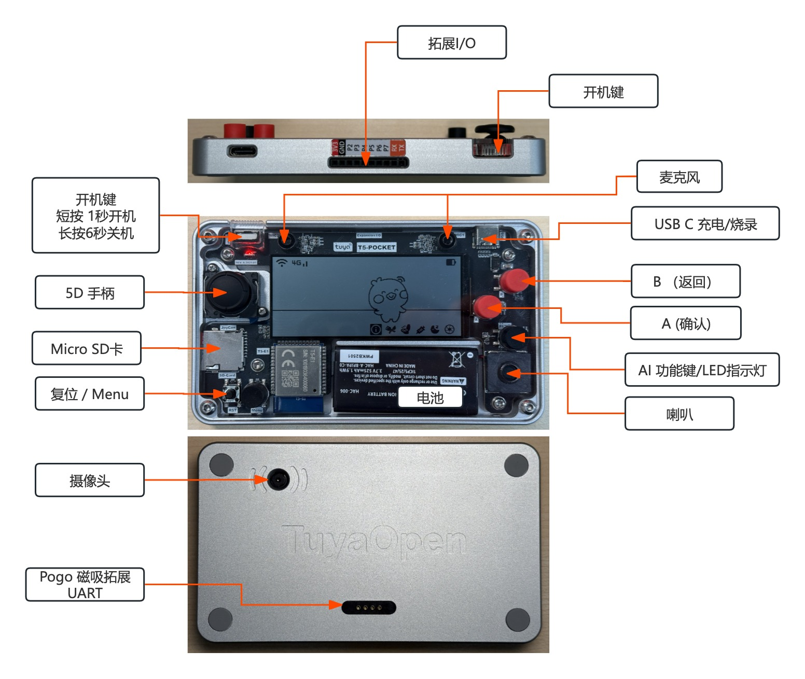

| 输入         | 功能描述                                 |
|--------------|------------------------------------------|
| 摇杆         | 菜单/应用导航                            |
| 摇杆按下     | 功能未定义                               |
| A 键         | 确认/选择/游戏 A                         |
| B 键         | 取消/返回/游戏 B                         |
| 功能键       | AI-LLM、音频及其他应用功能快捷入口        |
| 菜单键       | 主菜单访问                               |
| 用户 LED     | 指示 AI 功能活动，可自定义                |
| 复位键       | T5 MCU 硬件复位                          |


## 示例 Demos


## 涂丫丫 AI 宠物

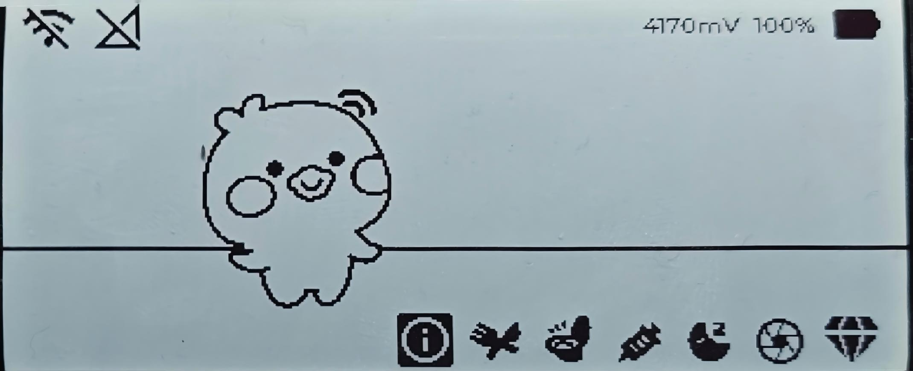
体验新一代虚拟宠物！涂鸦 AI 宠物主机演示展示了先进的音频、视觉、文本大模型（LLM）功能，让您的数字伙伴通过自然语音对话和情感感知与您互动。享受"类拓麻歌子-电子宠物"式的冒险，您的宠物会根据您的情绪和语音做出回应，带来真正沉浸式且有趣的虚拟陪伴体验。
- 摇杆手柄交互
- 语音模态交互
- 加速度传感交互
- 视觉模态感知
- 文本模态输入

- 宠物有 4 个关键状态："Health"（健康）、"Hungry"（饥饿）、"Clean"（清洁）、"Happy"（快乐），实际参数范围为 1~5
    
    > Debug 模式下，每 3 分钟会自动切换这 4 个随机参数，满足演示的多样性。
    
    > Info 菜单下的 `DEV: Randomize Pet Data` 选项也可手动触发随机参数。
    
- 喂食、洗澡、上厕所等用户操作都会影响宠物状态
- 喂食、与 AI LLM 聊天等操作都会反映在这些状态值的变化上
- 宠物状态同步至 App 端
- 情感反馈表达会渲染成动效

## AI 宠物开发计划 TODOs
- 宠物的情绪会根据当前状态进行反馈
- 摄像头视频感知多模态，支持拍照聊天
- 拍摄食物照片，可同步给宠物喂食，并记录用户的卡路里等数据
- 进一步丰富和完善游戏机制和引擎


## 贪吃蛇小游戏 Demo
该 Demo 展示了在T5 Pocket硬件上利用 LVGL UI 框架实现的经典贪吃蛇（Snake）小游戏。玩家通过摇杆控制贪吃蛇的移动方向，在狭小的黑白显示屏上体验极简风格的怀旧游戏乐趣。
- **操作说明**：玩家可使用摇杆操控贪吃蛇上下左右移动，尽量吃到屏幕上的“食物”，每当吃到一个食物蛇身会变长一节，游戏难度随长度加大。  
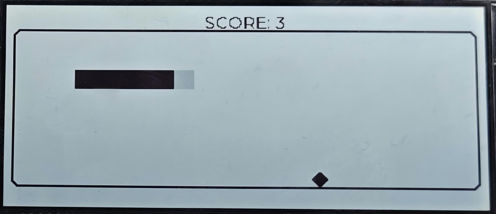
  

## Dino Jump小游戏 Demo
这是一个"跳跳龙"（Dino Jump/Chrome小恐龙）式跑酷游戏，同样基于LVGL渲染引擎实现。玩家需要操控恐龙（或小动物）持续奔跑，灵活跳跃躲避障碍物。  
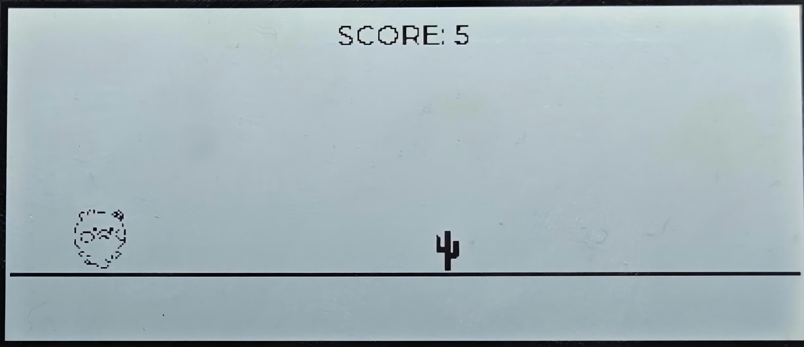


### 摄像头 Demo
本 Demo 展示了如何将摄像头采集的彩色图像实时转换并显示到单色 LCD 屏幕上。由于本设备屏幕为单色（黑白）且不支持灰阶显示，图像处理部分采用了经典的“抖动算法”（Dithering Algorithm），常用的有 Floyd–Steinberg、Bayer 抖动等。该算法可将采集到的彩色图像信息以视觉误差扩散的方式有机分布在屏幕像素上，从而在黑白显示屏上呈现出丰富的层次感，弱化失真与细节损失。
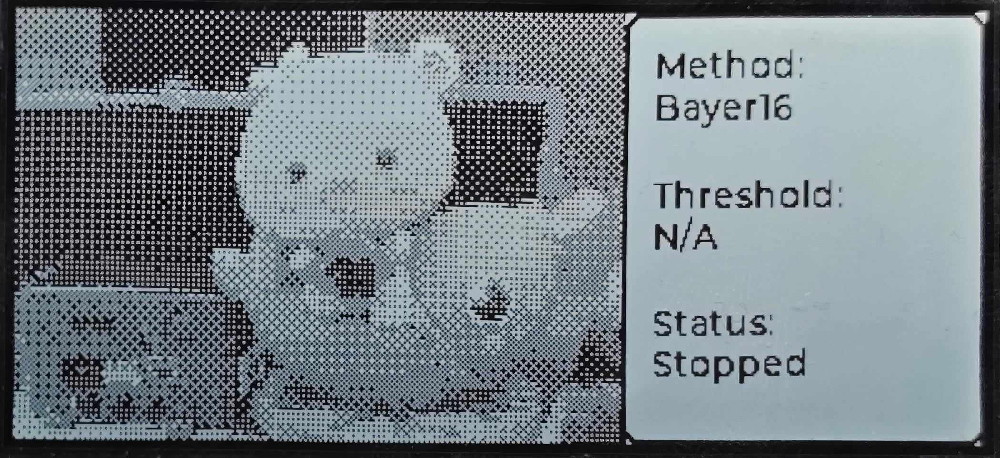


### 加速度测试水平仪 Demo
BMI270传感器读出，水平渲染Demo  
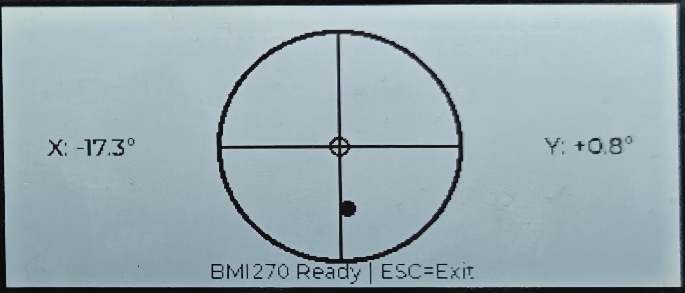

### 电子书Demo
SD卡读取TXT示例，EPUB兼容和字体抗锯齿也有待优化  


### 虚拟键盘组件
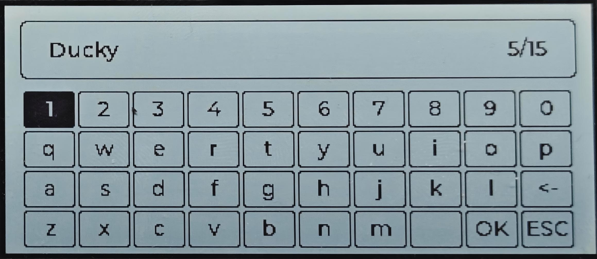

### I2C 检测工具
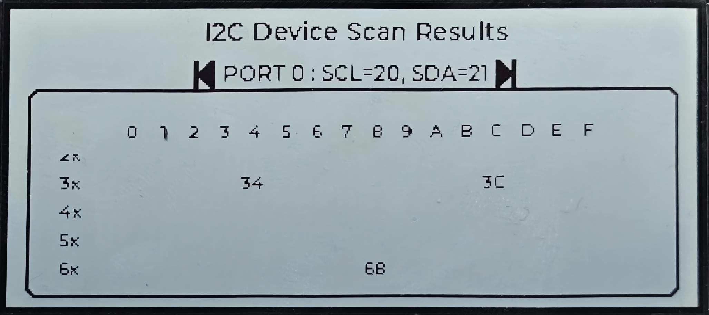


# 拓展外设
### AI 智能调试与协助工具
本 Demo 支持通过外部 UART 连接调试日志，用户不仅可以实时查看硬件运行信息，还能直接向 AI-Agent 提问，让 AI 智能协助分析硬件故障、定位问题，甚至对大量数据进行总结和洞察，生成更深入的分析报告。  
这充分展现了 AI 与硬件结合的无限可能——让开发调试更高效、更智能、更多元化。未来，AI+硬件的创新玩法，等你来解锁！

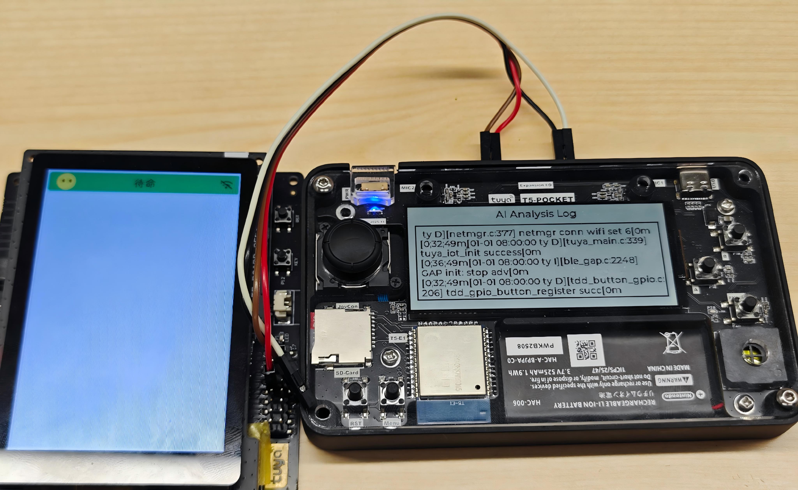

### 外挂温湿度传感器
- 顶部10Pin 拓展输出连接外挂传感器  
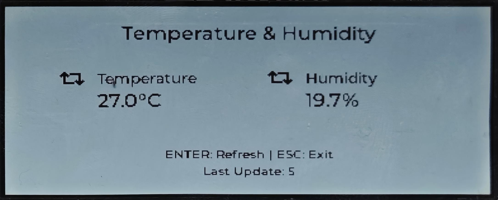

### DIY 拓展的RFID模块
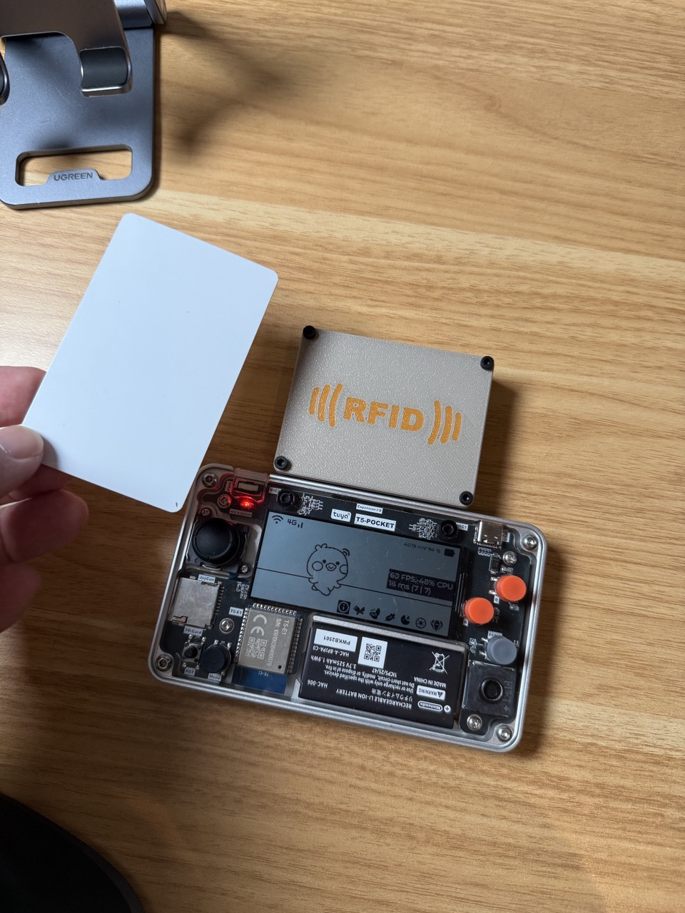
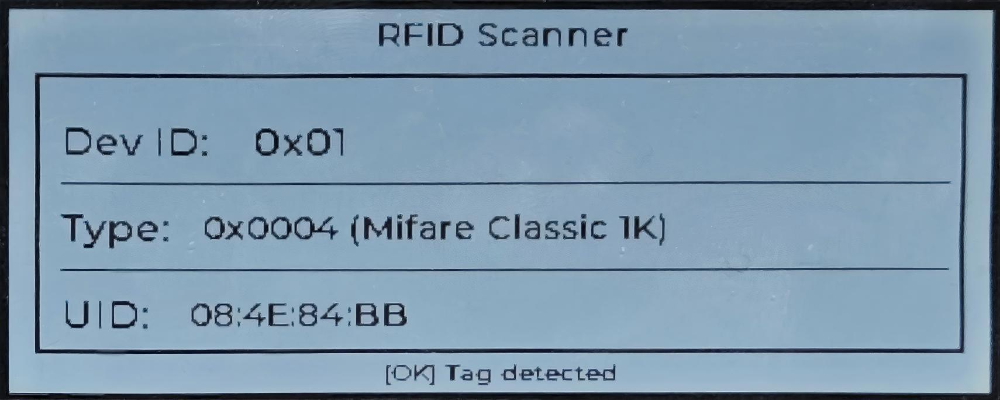

### DIY 拓展的热敏打印机
DIY 的拓展模块，可连接热敏打印机，实现AI生图和小票打印自由，或是AI赛博求签。
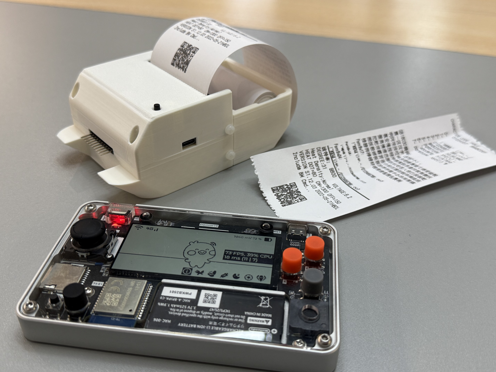

---

# 固件编译说明

> **重要提示**：详细的环境搭建、编译与烧录步骤，请参考 TuyaOpen 官方文档：  
> - [环境搭建指南](https://tuyaopen.ai/docs/quick-start/enviroment-setup)  
> - [项目编译指南](https://tuyaopen.ai/docs/quick-start/project-compilation)  
> - [固件烧录指南](https://tuyaopen.ai/docs/quick-start/firmware-burning)

### 前置要求

- 已完成 TuyaOpen SDK 环境配置（详见上方"环境搭建指南"）
- 终端支持 bash shell（Linux/macOS）或 PowerShell/CMD（Windows）
- 目标开发板：**TUYA_T5AI_POCKET**
- USB Type-C 数据线（用于烧录和调试）

### 快速构建和烧录流程

#### 步骤 1：进入 TuyaOpen SDK 根目录并导出环境变量

首先，确保您已克隆 TuyaOpen 仓库：

```bash
cd /path/to/TuyaOpen
```

然后执行环境变量导出脚本（根据操作系统选择）：

**Linux/macOS 系统：**
```bash
. ./export.sh
```

**Windows 系统：**
```powershell
.\export.ps1  # PowerShell（首次执行需先运行：Set-ExecutionPolicy RemoteSigned -Scope LocalMachine）
# 或
.\export.bat  # CMD
```

执行成功后，终端会显示环境配置信息，并激活 `tos.py` 编译工具。

#### 步骤 2：进入项目目录

```bash
cd apps/tuya_t5_pocket/tuya_t5_pocket_ai
```

#### 步骤 3：项目配置

首次构建时，需要选择硬件平台配置：

```bash
tos.py config
```

交互式选择界面会显示可用的板级配置，选择 **TUYA_T5AI_POCKET** 对应的编号（通常显示为类似 `TUYA_T5AI_POCKET.config` 的选项）。

配置完成后，系统会生成 `using.config` 文件，后续编译将使用此配置。

**可选：使用菜单配置进行详细设置**

如需进行更详细的配置（如功能模块开关、参数调整等），可使用菜单配置：

```bash
tos.py config menu
```

在配置菜单中可以：
- 选择开发板类型
- 配置应用参数
- 调整功能模块开关
- 修改编译选项

配置完成后按 `S` 保存，按 `Q` 退出。

#### **步骤 4：配置设备授权信息（重要！）**

在编译和运行项目前，必须配置设备的 UUID 和 AUTHKEY，否则设备无法连接到涂鸦云平台。

**获取 UUID 和 AUTHKEY：**

1. 访问 [涂鸦 IoT 平台](https://developer.tuya.com/cn/docs/iot-device-dev/application-creation?id=Kbxw7ket3aujc)
2. 创建产品或使用现有产品，获取 Product ID (PID)
3. 在设备管理页面获取或创建设备的 UUID 和 AUTHKEY（每个账户可免费获取 2 个设备授权）

**配置方法：**

编辑配置文件 `include/tuya_config.h`：

```c
#define TUYA_OPENSDK_UUID    "your-uuid-here"        // 替换为您的 UUID
#define TUYA_OPENSDK_AUTHKEY "your-authkey-here"    // 替换为您的 AUTHKEY
```

**注意：**
- UUID 和 AUTHKEY 必须与涂鸦 IoT 平台上的设备信息一致
- 请妥善保管您的 AUTHKEY，不要泄露给他人
- 如果使用默认的占位符值，设备将无法正常连接云端

#### 步骤 5：编译项目

配置完成后，执行编译命令：

```bash
tos.py build
```

编译过程会自动：
- 检查并更新 git 子模块
- 下载平台相关代码（如 platform/T5AI）
- 准备编译环境和工具链
- 使用 CMake 和 Ninja 进行编译
- 生成固件文件

**编译成功标志：**

终端会显示类似以下信息：

```
[NOTE]: 
====================[ BUILD SUCCESS ]===================
 Target    : tuya_t5_pocket_ai_QIO_1.0.0.bin
 Output    : /path/to/TuyaOpen/apps/tuya_t5_pocket/tuya_t5_pocket_ai/dist/tuya_t5_pocket_ai_1.0.0
 Platform  : T5AI
 Chip      : T5
 Board     : TUYA_T5AI_POCKET
 Framework : tuyaopen
========================================================
```

生成的固件文件位于 `dist/tuya_t5_pocket_ai_1.0.0/` 目录下：
- `tuya_t5_pocket_ai_QIO_1.0.0.bin`：完整固件（用于首次烧录）
- `tuya_t5_pocket_ai_UG_1.0.0.bin`：OTA 升级包（用于远程升级）

#### 步骤 6：烧录固件到设备

**硬件准备：**
- 使用 USB Type-C 数据线连接设备到电脑
- 软件烧写工具会自动把设备放到烧写模式

**串口说明：**

设备连接电脑后，系统会识别出两个串口：

- **CH1（串口 1）**：用于固件下载和烧录
  - 烧录波特率：自适应（软件会自动调整，无需手动设置）
  - 用途：固件烧录、设备控制

- **CH2（串口 2）**：用于日志输出和调试
  - 日志波特率：**460800**
  - 用途：查看设备运行日志、调试信息输出
  - 可使用串口工具（如 PuTTY、minicom、screen 等）连接查看日志

**注意事项：**
- 烧录时使用 CH1 串口，波特率会自动适配，通常无需手动指定
- 如需查看设备日志，请使用 CH2 串口，波特率设置为 460800
- 两个串口可以同时使用，互不干扰

**烧录方法：**

**方法 1：使用 tos.py flash 命令（推荐）**

```bash
tos.py flash
```

如果需要指定串口或波特率：

```bash
tos.py flash -p /dev/ttyUSB0        # Linux，指定串口
tos.py flash -p COM3                 # Windows，指定串口
tos.py flash -p /dev/ttyUSB0 -b 921600  # 指定串口和波特率
```

**方法 2：使用官方烧录工具**

详细步骤请参考 [固件烧录指南](https://tuyaopen.ai/docs/quick-start/firmware-burning)。

**烧录成功标志：**

终端会显示烧录进度和成功信息，设备会自动重启并运行新固件。

#### 步骤 7：下载 App 并配对设备

固件烧录完成后，需要下载涂鸦 App 或 Smart Life App 进行设备配对和配网。

**下载 App：**

- **iPhone 用户**：在 App Store 搜索并下载 **"涂鸦智能"** 或 **"Smart Life"**
- **Android 用户**：在 Google Play 或应用商店搜索并下载 **"涂鸦智能"** 或 **"Smart Life"**

**设备配对和配网流程：**

1. **打开 App 并登录账号**
   - 首次使用需要注册涂鸦账号
   - 登录后进入 App 首页

2. **添加设备**
   - 点击 App 首页的 **"+"** 或 **"添加设备"** 按钮
   - 选择 **"添加设备"** 或 **"扫码添加"** 选项
   - 如果设备显示二维码，可直接扫描二维码添加

3. **选择配网方式**
   - 推荐使用 **WiFi 配网** 方式
   - **重要提示**：设备仅支持 **2.4GHz WiFi 网络**，不支持 5GHz WiFi
   - 确保手机连接到 2.4GHz WiFi 网络（或手机热点设置为 2.4GHz）

4. **输入 WiFi 密码**
   - 在 App 中输入您的 2.4GHz WiFi 密码
   - 确认 WiFi 名称（SSID）正确

5. **等待设备连接**
   - 按照 App 提示操作，设备会自动进入配网模式
   - 等待设备连接到 WiFi 网络（通常需要 30-60 秒）
   - 配网成功后，设备会出现在 App 的设备列表中

6. **开始使用**
   - 设备配对成功后，可以在 App 中查看设备状态
   - 可以通过 App 控制设备功能、查看 AI 宠物状态等

**配网注意事项：**
- 确保设备与路由器距离适中，信号良好
- 如果配网失败，可以尝试重启设备后重新配网
- 某些路由器可能需要在路由器设置中开启 2.4GHz 频段
- 如果遇到配网问题，可以参考下方"常见问题排查"中的硬重置方法进行设备重置

### 常见问题排查
**编译失败：**
- 检查环境是否正确配置（执行 `export.sh`）
- 确认已安装所有依赖（Python、CMake、Ninja 等）
- 检查网络连接（首次编译需要下载平台代码）

**烧录失败：**
- 检查 USB 连接是否正常
- 确认设备处于烧录模式
- 检查串口权限（Linux 可能需要添加用户到 dialout 组）
- 尝试更换 USB 端口或数据线

**设备无法连接云端：**
- 确认已正确配置 UUID 和 AUTHKEY
- 检查 Product ID 是否与平台一致
- 确认设备网络连接正常（WiFi 或 4G）
- 查看设备日志输出排查问题

**如何重置设备配对信息和 WiFi 配置（硬重置）：**
- 如果设备配对信息错误或需要重新配置网络，可以通过硬重置清除所有配对和 WiFi 信息

- **硬重置方法**：连续开关机三次（即：开机 → 关机 → 开机 → 关机 → 开机 → 关机），第四次开机时设备会自动清除所有配对信息和 WiFi 配置，恢复到出厂状态
- 重置后需要重新进行设备配网和绑定操作


# 代码仓库
- **TuyaOpen 主仓库**：https://github.com/tuya/TuyaOpen
- **口袋机项目代码位置**：https://github.com/tuya/TuyaOpen/tree/master/apps/tuya_t5_pocket


  
# 资料链接清单

### 口袋机相关资料
- **结构**
  - 3D 结构 .STEP：（待补充）  

- **生产资料**
  - 2D 激光切割-亚克力：（待补充）
  - 3D打印：（待补充）

### TuyaOpen开源项目
- TuyaOpen官网：https://tuyaopen.ai
- TuyaOpen Github 开源仓库：https://github.com/tuya/TuyaOpen
### T5 芯片/模组
- 涂鸦 T5 芯片规格书：https://developer.tuya.com/en/docs/iot/wifibt-dual-mode-chip?id=Ke3voh7uu0htz
- 涂鸦 T5-E1 （板载天线）模组规格书：https://developer.tuya.com/en/docs/iot/T5-E1-Module-Datasheet?id=Kdar6hf0kzmfi
- 涂鸦 T5E1-IPEX （外置天线） 模组规格书：https://developer.tuya.com/en/docs/iot/T5-E1-IPEX-Module-Datasheet?id=Kdskxvxe835tq
### 云端开发文档
- 云端 AI-Agent 智能体开发：https://developer.tuya.com/en/docs/iot/agent?id=Kdxnn04ancnc8
- 定制 APP 面板（小程序）开发：https://developer.tuya.com/en/docs/iot/tuya-miniapp?id=Ketcqlpvzaa1v  
- 定制 MCP开发SDK： https://github.com/tuya/tuya-mcp-sdk
- 定制 MCP 云配置文档：https://developer.tuya.com/en/docs/iot/custom-mcp?id=Kety4zbdvwdn8
### 其他开发板：通用让你快速上手 TuyaOpen
- T5AI-Board 开发套件：https://www.tuyaopen.ai/docs/hardware-specific/t5-ai-board/overview-t5-ai-board
- T5AI-Core 最小核心开发套件 https://www.tuyaopen.ai/docs/hardware-specific/t5-ai-core/overview-t5-ai-core


